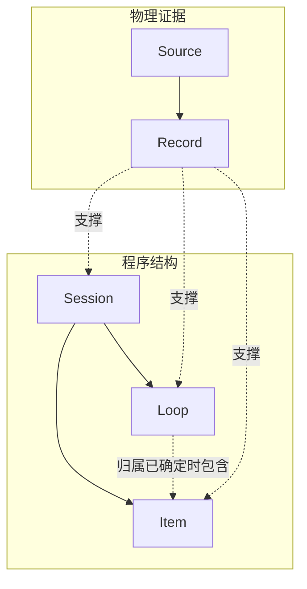

# Trace Index 领域模型

> [!IMPORTANT]
> Trace Index 用五个核心实体组织 Agent Trace：物理视角的 Source、Record，以及程序结构视角的 Session、Loop、Item。程序实体必须由物理证据支撑，物理记录本身不等于有查询价值的语义事实。

设想一次常见的 Agent 运行：用户要求检查构建失败，Runtime 把输入交给模型，执行模型发起的工具调用，再把工具结果交回模型。在这个过程中，Runtime 会把部分输入、生成、工具调用和工具结果写成物理 Trace 记录。

如果只按文件和记录逐条读取，调用方很难判断这些记录是否属于同一个 Agent 上下文、同一轮执行，或者同一次工具活动。Trace Index 一方面保留 Runtime 实际写下的物理记录，另一方面把有查询价值的活动整理成一致的程序结构。这就是下面两个视角的来源。

## 两个互补视角

Runtime 持续维护 Agent 当前可见的上下文，并在收到输入后驱动模型和工具运行。它还会把其中部分活动写成物理记录。Trace Index 同时保留这两个视角。

图中的实线表示程序结构或物理包含关系。Record 指向 Session、Loop 和 Item 的虚线表示 Record 可以为这些程序实体提供证据，不表示每条 Record 都会同时支撑三种实体。

程序结构让 Agent 能够以一致方式查询“发生了什么”。物理证据则让这些结论能够回到“Runtime 实际写下了什么”。两者缺一不可。只看物理记录，难以跨 Runtime 组合。只保留程序投影，则无法验证来源。

## 五个核心实体

| 视角 | 实体 | 回答的问题 |
| --- | --- | --- |
| 物理证据 | Source | 这些记录来自哪一份可以独立定位、读取并隔离变化的物理输入，例如一份 Trace 文件？ |
| 物理证据 | Record | Runtime 实际写下了哪一条边界完整、可独立定位的物理记录？ |
| 程序结构 | Session | 哪些活动共享同一个由 Runtime 持续维护的 Agent 上下文？ |
| 程序结构 | Loop | Agent Loop 的一次程序生命周期从哪里开始，到哪里结束？ |
| 程序结构 | Item | 哪些运行事实具有独立查询价值，它们属于哪个 Session？ |

## 物理证据

**Source** 是 Trace Index 能够单独定位和读取的一份物理 Trace 输入。它的变化或读取失败不会改变其他 Source。其中的 Record 只在这份 Source 内部排序。Trace Index v1 中，Source 就是一份 Runtime 写出的 JSONL Trace 文件。

**Record** 是 Source 中一条边界完整、能够独立定位和校验的物理记录。Source 规定其读取范围，Record 保留其在 Source 中的位置和原始内容依据。边界完整不表示内容语法有效，也不说明它在 Agent 程序结构中的含义。

一份有效 Source 只支撑一个逻辑 Session。一个完整 Session 可以由同一历史链中的多份 Source 共同支撑，所以 Source 不能被直接等同于 Session。

## 程序结构

**Session** 是 Runtime 赋予身份并持续维护的 Agent 上下文。恢复同一个上下文会延续原 Session。建立能够独立继续的新上下文并继承历史时，新 Session 具有 `forked_from`。由父 Agent 委派独立上下文时，新 Session 具有 `delegated_from`。这两项父级属性不表示两个 Session 是同一个上下文。

**Loop** 是 Agent Runtime 驱动的一轮执行。它从 Runtime 接受启动或继续信号开始，经过模型生成、工具调用和结果反馈，直至本轮结束。Loop 边界由 Runtime 结构和可用证据决定，不由一段自然语言包含多少任务决定。

**Item** 是 Trace Index 从 Record 中选择保留的一项有独立查询价值的语义事实，例如一次输入、上下文注入、Agent 输出、工具调用、工具结果，或者 Runtime 提供的独立状态与通知。

Item 不承诺覆盖每条 Record。一条 Record 可以形成零项或多项 Item，多条 Record 也可以共同支撑同一次语义发生。每个 Item 属于一个 Session。Loop 归属和顺序证据充分时，它还可以在所属 Loop 内排序。

为了让调用方既能统一查询又能返回来源，Item 用 `semantic` 保存 Trace Index 定义的跨 Runtime 语义及其判断强度，用 `record_ids` 保存支撑这项解释的物理来源。没有形成稳定语义的 Runtime 内容仍由 Record 保存，不会为了覆盖每条原始记录而生成 Item。

## 两个视角如何连接

Trace Index 根据 Record 建立 Session、Loop 和 Item。一个程序实体可以由一条或多条 Record 支撑，同一条 Record 也可以为多个程序事实提供证据。建立这些事实时，系统必须保留：

- 使用了哪些 Record。
- 根据哪一种稳定规则建立事实。
- 规则无法确定时保留什么缺失或不确定性。

例如，同一个 Session 恢复运行后，它的历史可能写入多份 Source。每份 Source 当前已发布的 Record 集合先决定哪些物理证据可以参与投影。系统再按照 Session 身份、Source 关系，以及 `forked_from` 和 `delegated_from` 两项父级属性，组合这些 Record 所建立的事实，形成一个逻辑 Session。完整语义见投影专题。

## 模型边界

Task、Project、Transcript、统计结果和查询视图不是核心实体。

- **Task** 依赖目标和自然语义，不能从 Session 或 Loop 边界自动推出。
- **Project** 可以用于限定来源范围，但不拥有另一份 Agent 执行历史。
- **Transcript** 是从 Item 中形成的阅读视图。
- **统计与查询结果** 是对核心事实的派生读取，不拥有独立来源事实。

内容相同不能单独决定身份。两条相同的物理记录仍是两个 Record。同一内容真实发生两次时，也必须形成两个 Item。反过来，多条 Record 如果只是同一次语义发生的重复表达，可以共同支撑一个 Item，而不是制造重复 Item。每类实体的身份依据由对应领域模型定义。

## 继续阅读

- [Source 领域模型](/design/model/source)、[Record 领域模型](/design/model/record)：先理解物理输入和最小证据单位。
- [Session 领域模型](/design/model/session)、[Loop 领域模型](/design/model/loop)、[Item 领域模型](/design/model/item)：再理解 Agent 的上下文、运行生命周期和语义事实。
- [Trace Index 投影模型](/design/evidence-and-provenance)：理解两个视角怎样连接并保持可重建。
- [Trace Index 词汇表](/design/glossary)：查阅本系列中可能产生歧义的术语。
