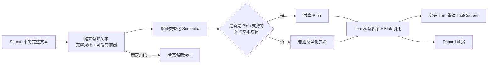

# Trace Index 语义文本 Blob

> [!IMPORTANT]
> Trace Index 的 Blob 是 Item 语义文本的私有共享存储，不是领域对象、公共查询入口或原始证据。它在不改变 `Item.semantic` 契约的前提下，让有界文本只保存一次；查询时仍返回完整的类型化 `TextContent`，需要完整 Runtime 表示时仍沿 Item 的 Record 证据回到 Source。

[Trace Index Item 语义契约](/design/model/semantic-contract) 定义哪些字段是 `TextContent` 以及它们对完整性和规模的承诺。本页只解释 Blob 怎样在架构中兑现这些承诺，并把公开语义、私有存储、全文检索和原始证据分开。精确表、列、散列算法、默认上限和迁移版本由代码仓库拥有。

## Blob 解决什么问题

Agent Trace 中的指令、上下文、对话回放和工具结果可能很长，也可能跨 Source 大量重复。若每个 Item 都内联同一份文本，存储与写入成本会随回放次数重复增长；若只保存一个没有边界说明的截短值，Agent 又会把前缀误认为完整事实。

Blob 同时承担两项存储责任：

1. 保存 Trace Index 允许公开的有界语义文本，以及描述完整 Source 文本规模所需的度量。
2. 让内容和发布范围相同的语义文本共享一份物理表示，而每个 Item 仍保持自己的身份、角色、顺序和 Record 证据。

这是一项存储能力，不会增加第六个领域对象。重复文本的物理复用也不表示对应 Item、Session 或 Source 在领域上相同。

## 从 Source 文本到公开 Item

Adapter 先从 Source 中的完整文本建立一个有界表示。它保留完整文本的内容身份和规模，只让 UTF-8 字符边界上的前缀进入语义投影。投影先构造并验证完整的类型化 `SemanticValue`，再把其中选定的 `TextContent` 交给 Blob 存储。

Item 私有表示保存不含该文本对象的类型化骨架，并引用共享 Blob。公共查询按 `semantic.role` 规定的路径把 Blob 重新放回 `text` 或 `summary`，所以调用方看到的仍是领域契约定义的 `SemanticValue`，不需要知道 Blob 身份或布局。

## 共享身份由完整内容和发布范围共同决定

Blob 的共享判断同时依赖完整 Source 文本的内容身份与当前发布前缀的字节范围。

- 完整内容相同且发布范围相同，可以共享同一份 Blob。
- 完整内容不同，即使当前可见前缀相同，也不能共享。
- 完整内容相同但发布范围不同，需要不同的物理表示；改变文本上限后重建可以扩大或缩小公开前缀，而不会把旧范围误当成新范围。

这条规则让内容去重不破坏有界观察语义。具体内容摘要算法和物理唯一性约束只是当前实现手段，不进入公共契约。

## Blob 只支持选定的语义文本

Blob 不是通用 JSON 外置层。它只承载 `SemanticValue` 中由 Item 契约选定的主要 `TextContent`：普通文本、推理、工具输出、委派与子 Agent 文本、指令、上下文，以及压缩摘要。不同角色的文本路径由判别联合决定。

工具参数和 Shell 结构仍是各自的类型化值。完整的结构化参数可以直接进入 ToolCall；参数一旦只剩有界前缀，就不能伪装成完整 JSON，而应省略公开参数并通过 Record 恢复。Shell Fragment 的嵌套文字与解析结构也不因为体积而自动变成通用 Blob 引用。

这个边界保证私有存储不会反过来扩张或模糊 `SemanticValue`。新增 Blob 用途必须先有领域契约中的真实文本成员，不能只因为某段 JSON 较大就外置。

## 与全文检索和原始证据的边界

Blob、全文检索和 Record 回答三个不同问题：

| 能力 | 回答的问题 | 是否拥有事实 |
| --- | --- | --- |
| Blob | 怎样低成本保存和重建已发布的有界语义文本 | 否，只是 Item 的私有存储 |
| 全文检索 | 哪些 Item 可能包含待查文字 | 否，只是由选定 Item 文本重建的候选入口 |
| Record | Runtime 实际持久化了什么、完整内容位于哪里 | 是，拥有物理证据 |

全文检索可以读取同一个有界前缀作为输入，但是否进入检索由 Item 契约单独选择。存在 Blob 不表示文本可被全文搜索；当前未纳入检索的工具输出仍可以通过 Item 查询。删除或重建搜索结构也不会改变 Blob 支持的公开 Item。

Blob 也不保存 Trace Index 上限之外的完整 Runtime 字节。`TextContent.full_bytes` 和 `estimated_tokens` 描述 Source 中完整文本的规模，`value` 只承载当前发布内容。需要核对完整表示时，调用方沿 `Item.record_ids` 读取和验证 Record。Runtime 在写入 Source 前已经发生的截断，则由 Runtime 自己报告的事实表达，不能从 Blob 的发布边界反推。

## 发布与失败语义

Blob 引用与对应 Item 属于同一次 Source 投影发布。新 Blob 可以在一次同步运行中跨 Source 复用，但缓存只是一项加速机制：某个 Source 写入回滚后，后续 Source 不能继续引用已经随事务消失的 Blob。

Source 改写、Adapter 规则变化或文本上限变化需要重建受影响的 Item。查询者只能看到重建前的完整 Item，或重建后已经能够重建 `TextContent` 的完整 Item，不能看到缺少 Blob、引用悬空或新旧文本范围混合的状态。这项整体可见性服从 [Trace Index 发布与一致性](/design/index-consistency)。

## 必须保持的不变量

1. 私有存储前后的公开 `Item.semantic` 在类型和含义上相同。
2. 有界前缀必须在 UTF-8 边界结束，并通过 `value` 与 `full_bytes` 的关系如实表达完整性。
3. 内容共享不能合并不同的完整文本或不同的发布范围，也不能合并 Item 身份和证据。
4. Blob 身份、摘要和物理布局不得进入公共领域契约；普通分析只依赖 Item。
5. Blob 不取代 Record。任何需要完整 Runtime 表示或原始证明的任务仍沿物理证据读取。
6. Blob 与全文检索独立：前者优化保存与重建，后者只负责候选召回。

## 页面边界

本页拥有 Trace Index 语义文本 Blob 的稳定架构责任和边界。[Trace Index Item 语义契约](/design/model/semantic-contract) 拥有 `TextContent` 及各角色的精确 Value 形状，[Trace Index 总体架构](/design/architecture) 拥有物理证据、程序投影、直接查询与全文检索的整体分工。

当前支持哪些角色、默认发布多少字节、使用哪种摘要、怎样建表和索引、冷建与增量写入采用什么 SQL、怎样清理不再引用的物理数据，以及对应测试结果，都由代码仓库、机器可读接口与版本化测试维护，不在 领域文档 复制。
