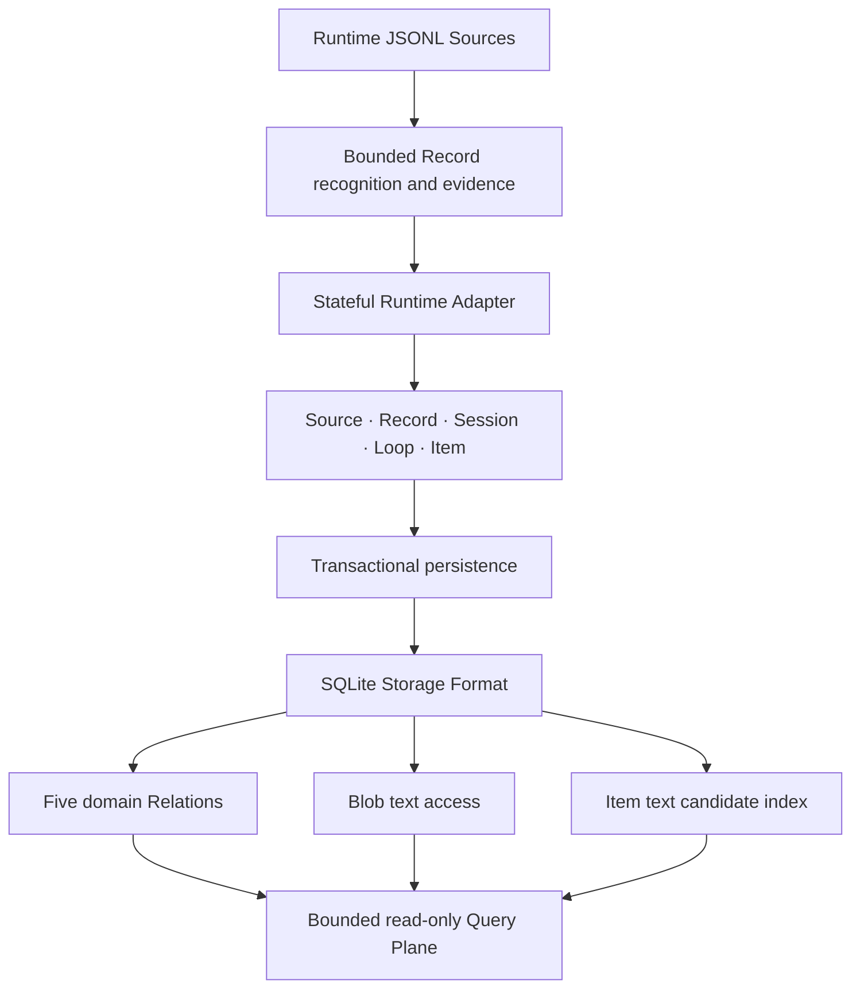

# Architecture

Trace Index is a single Rust binary backed by a rebuildable SQLite derivative.

## Code boundaries

- `ingest` discovers Sources, reads complete Records within explicit bounds, and maintains byte locators and fingerprints.
- `adapters` detects Codex, Pi, and Claude Code and projects ordered Records into adapter-neutral facts. It owns Runtime mappings and private rule diagnostics.
- `domain` declares the Semantic role/value contract, evidence strength, Loop outcomes, and typed nested values.
- `storage` defines Storage Format 1, persists physical and domain facts, privately deduplicates bounded Semantic text, publishes five domain Relations plus the `blobs` and `item_search` access Relations, and validates database shape.
- `indexing` coordinates per-Source synchronization, status, progress, and telemetry.
- `interface` owns configuration, bundled documentation, public-schema discovery, bounded SQL, and stable machine output.
- `shell` extracts the shell structure embedded in supported Semantic tool-call values. Its structs are nested Item values rather than additional public domain entities.

## Stateful projection

Record framing is physical and local. Domain projection is stateful because Session identity, Loop boundaries, multi-Record Item evidence, request-versus-steering, and tool call/output correlation depend on surrounding Records.

An Adapter processes one ordered candidate file and emits facts only after their required structural evidence exists. A Source that resumes an existing logical context contributes to the same Session; replacing that Source's projection must not erase facts contributed by the Session's other Sources. A candidate file without a confirmed Session identity is skipped atomically rather than being published as a partial Source.

## Incremental physical input, replaceable domain projection

The physical layer indexes complete appended Records and fingerprints the indexed prefix. A changed prefix triggers a Source rebuild. The domain projection for a changed Source is replaced coherently because later Records can resolve earlier optional fields or add another witness to an existing Item.

Each Source update is transactional. Readers see either the previous committed projection or the new one, never half of a Session contribution. WAL mode lets read commands use a consistent snapshot while `index sync` writes.

## Query contract

Only explicit `index sync` opens the database for writes. Schema discovery, queries, status, and evidence inspection open the existing index read-only. SQL execution is bounded by time and output budgets and cannot attach another database or mutate the index.

The stable SQL surface is `sources`, `records`, `sessions`, `loops`, `items`, `blobs`, and `item_search`. The first five publish domain objects. `items.semantic` encodes the domain Semantic as `{role, value, evidence_strength}`; only its top-level TextContent changes representation, becoming a BlobRef resolved through `blobs`. This SQL encoding is an interface choice, not a second domain model. `blobs` and `item_search` provide demand-driven text access and candidate retrieval without becoming domain entities. Private tables may still be readable because the local caller owns the database, but they carry storage mechanics rather than public meaning.

`item_search` is maintained from selected Semantic text. It accelerates candidate recall and returns to `items` for meaning and provenance, then to `blobs` for exact text. Non-text queries never need the Blob access path.

## Rebuildable evidence derivative

The database is not an archive. Raw bytes remain in Sources, and Record locators plus fingerprints provide the verification path. Storage Format changes rebuild the derivative from those Sources instead of migrating private tables indefinitely.

The design keeps complexity proportional to observed needs. A new public entity, View, command, or stored relation must solve a real problem that the five objects and bounded SQL cannot express simply. Convenience and hypothetical future cases do not expand the contract.
